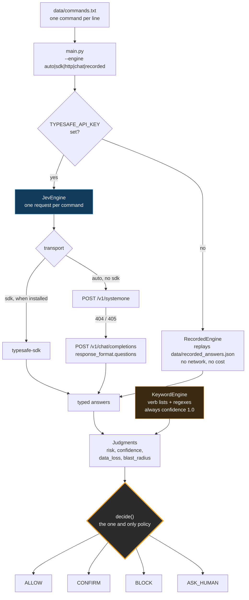
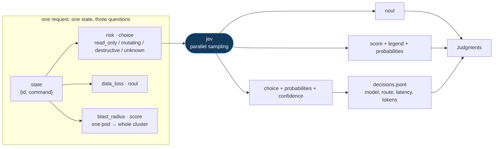
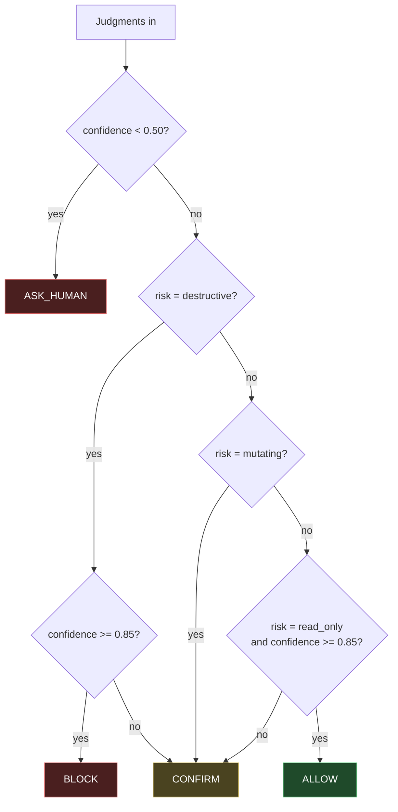

# Jev Demo: the same policy, with and without Jev

[Jev](https://typesafe.ai) is TypeSafe AI's **System One** model. You send it
*state* (the thing to judge) plus *typed questions*, and it returns typed
answers with calibrated probabilities. It never writes text, and an answer can
only be one of the labels you defined.

The whole API is three question types:

| Type    | Asks                          | Returns                                    | Use when                       |
| ------- | ----------------------------- | ------------------------------------------ | ------------------------------ |
| `Noul`  | "Is this true?"               | `noul`, one probability from 0 to 1         | a single yes/no decision       |
| `Choice`| "Which of these?"             | `choice`, `probabilities`, `confidence`    | you can enumerate the options  |
| `Score` | "Where on this scale?"        | `score`, `legend`, `probabilities`         | the answers are ordered        |

Every question in one request sees the same state, is evaluated in parallel, and
costs almost no extra latency, so you ask everything you might need up front.
Code reads the answers and decides what happens.

## What this demo does

One job: decide what to do with a `kubectl` or `helm` command. `ALLOW`, `CONFIRM`,
`BLOCK`, or `ASK_HUMAN` when the judgment is too unsure to act on.

The interesting part is that **there is only one policy**. Both engines fill the
same `Judgments` record (`jev_demo/policy.py`), and the same `decide()` function
turns judgments into actions. Only the source of the judgment changes:

- `jev_demo/keywords.py` — the engine you write without Jev: verb allowlists and
  regexes. Fast, free, and certain about everything it matches.
- `jev_demo/engines.py` — `JevEngine`, which POSTs to your endpoint, and
  `RecordedEngine`, which replays canned answers so the demo runs with no key
  and no network. The transport is stdlib HTTP by default (no dependencies); it
  switches to `typesafe-sdk` when that package is installed.
- `jev_demo/questions.py` — the three typed questions, in the exact shape that
  goes on the wire.
- `jev_demo/config.py` — the `.env` reader and the settings lookup.

## The flow




Both engines produce the same five fields, so everything downstream of
`Judgments` is identical no matter which one ran. Only the source of the
judgment changes.

### The request, and what comes back



### The policy



Reading it: the keyword engine always answers with confidence 1.0, so it never
reaches `ASK_HUMAN` and never softens a `BLOCK` into a `CONFIRM`. The jev
engine's confidence is what moves commands between those branches.

## Run it

Offline, no key needed (recorded answers, not live jev):

```bash
python3 -m jev_demo.main --engine recorded
python3 -m jev_demo.main --engine recorded --details   # show the judgments
```

Live, against the hosted API or your own deployment:

```bash
cp .env.example .env      # then edit it
python3 -m jev_demo.main --ping     # check endpoint + key + model name
python3 -m jev_demo.main --engine jev
```

Or keep everything in the shell:

```bash
export TYPESAFE_BASE_URL=https://jev.internal.example   # self-hosted only
export TYPESAFE_API_KEY=...
export JEV_MODEL=jev-1.13.0                            # must match your server
python3 -m jev_demo.main --engine jev
```

`jev_demo/config.py` reads `.env` from the repo root before anything else, so
you do not have to export anything. Variables already set in the shell win over
the file, which is what lets CI and one-off runs override a local default.
`JEV_ENV_FILE=/some/other/.env` points somewhere else, and `--quiet` hides the
`config: loaded .env` line.

| Variable            | Default                  | Purpose                                        |
| ------------------- | ------------------------ | ---------------------------------------------- |
| `TYPESAFE_BASE_URL` | `https://api.typesafe.ai`| your server; a trailing `/v1` is fine           |
| `TYPESAFE_API_KEY`  | —                        | required for live mode (`JEV_API_KEY` also works) |
| `JEV_MODEL`         | `jev-1.13.0`             | must match a model your server serves, gateways namespace it like `typesafe/jev-1.13.0` |
| `JEV_TIMEOUT`       | `30`                     | seconds per request                            |
| `JEV_DECISION_LOG`  | `decisions.jsonl`        | append log; `-` writes records to stdout       |
| `JEV_ENV_FILE`      | `<repo>/.env`            | alternative `.env` location                    |

`--transport {auto,sdk,http,chat}` picks the client. `auto` prefers
`typesafe-sdk` when installed (`pip install -r requirements.txt`, Python 3.10+),
tries `POST /v1/systemone`, and switches to the gateway route on a 404:

| Transport | Route                                                          | Use when                                             |
| --------- | -------------------------------------------------------------- | ---------------------------------------------------- |
| `http`    | `POST {base}/v1/systemone`                                      | the native SystemOne API (hosted or self-hosted)     |
| `chat`    | `POST {base}/v1/chat/completions` with `response_format.questions` | a LiteLLM-style OpenAI gateway; state goes in a user message |
| `sdk`     | `typesafe-sdk`                                                  | you prefer the SDK's retries and typed answers       |

`--ping` prints which route answered, so you can confirm the setup:

```
ok  https://api.ai.kodekloud.com/v1/chat/completions
    via chat model=typesafe/jev-1.13.0 noul=0.92 latency=542.2ms
```

Every live decision is appended to `JEV_DECISION_LOG` with the model version,
the route used, latency and full probabilities, so you can tune thresholds
against your own data later.

`--engine auto` (the default) picks `jev` when `TYPESAFE_API_KEY` is set and
falls back to `recorded` otherwise.

Edit `data/commands.txt` to add cases. When you add one there, add an entry with
the same id to `data/recorded_answers.json`, otherwise the offline run fails.

## What the run shows

A live run against `typesafe/jev-1.13.0` looked like this:

```
*kubectl logs -l app=checkout --since=1h | grep "delete reques  BLOCK                  ALLOW
*kubectl drain node-3 --ignore-daemonsets                       BLOCK                  CONFIRM
*kubectl logs checkout-7d9f -n shop | tail -50 && kubectl dele  BLOCK                  CONFIRM
*helm uninstall shop -n shop                                    CONFIRM                BLOCK
```

Four of fifteen decisions differ, and both directions are wrong somewhere:

- **False blocks.** `grep "delete request"` matches the word `delete`. The regex
  cannot tell reading a log line from deleting a pod, so it blocks a harmless
  command.
- **False allows.** `helm uninstall shop -n shop` matches no verb in the
  keyword lists at all, so it gets a routine `CONFIRM` while the jev engine
  blocks it. This is the expensive direction.
- **Blunt confidence.** `kubectl drain node-3` is flagged as destructive by the
  regex, but it is only partly reversible, so a human should confirm rather than
  have the tool block it.
- **Honest uncertainty.** `./deploy.sh --env=prod` tells a keyword engine
  nothing, and it reports `unknown` at confidence 1.0. Jev reports `unknown` at
  low confidence, which trips the review floor in `decide()` and routes to a
  human. Confidence is the part that changes the architecture: below the floor,
  ask; above it, act.

Which cases differ varies between runs and models — the recorded answers in
`data/recorded_answers.json` disagree with the live model on two of them, which
is exactly why the offline run is a mechanics demo and not a substitute for
labelling your own traffic.

## The three things worth taking away

1. **Code keeps the loop, Jev keeps the judgment.** `decide()` never changes.
   A wrong answer can only ever cause an action you already allowed.
2. **Confidence is the routing knob.** Below `REVIEW_FLOOR` (0.50) a human
   decides. Above `AUTO_TRUST` (0.85) code acts alone. In between, ask. Those
   cutoffs are examples; tune them on your own labeled traffic.
3. **Deterministic work stays in Python.** Jev reads instructions literally and
   is bad at counting and date math, so parsing, arithmetic and hard safety
   rules stay in code. Use it for the fuzzy middle, not for what a regex
   already gets right.
